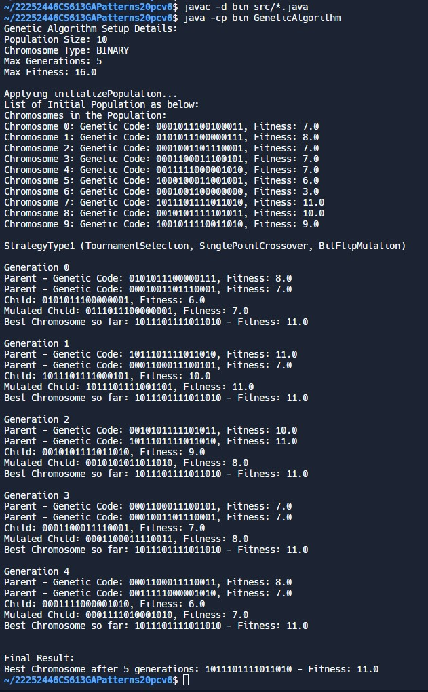

# CS613 Group CA - Genetic Algorithm
- TeamMember 1: Charan Reddy 25% effort
- TeamMember 2: Chi Ieong Ng (22252446) 25% effort
- TeamMember 3: Rohan Shanavas 25% effort
- TeamMember 4: Vishesh Kapoor (22250685) 25% effort


## File Structure:
root/\
└── src/\
| ├── BinaryChromosome.java\
| ├── BinaryChromosomeFactory.java\
| ├── BitFlipMutation.java\
| ├── Chromosome.java\
| ├── ChromosomeFactory.java\
| ├── ChromosomeFactory.java\
| ├── ChromosomeType.java\
| ├── GeneticAlgorithm.java\
| ├── IntegerChromosome.java\
| ├── IntegerChromosomeFactory.java\
| ├── Operator.java\
| ├── Population.java\
| ├── PopulationFactory.java\
| ├── RandomValueMutation.java\
| ├── RouletteWheelSelection.java\
| ├── SinglePointCrossover.java\
| ├── Strategy.java\
| ├── StrategyType1.java\
| ├── StrategyType2.java\
| ├── TournamentSelection.java\
| └── TwoPointCrossover.java\
└── bin/\
└── doc/\
└── README.txt\
└── README.md\

## File Description
- `BinaryChromosomeFactory.java`: A factory class for creating instances of BinaryChromosome. It follows the Singleton pattern, ensuring only one instance of the factory exists.

- `Chromosome.java`: An abstract class representing a chromosome. It holds a genetic code, fitness value, and chromosome type.

- `ChromosomeFactory.java`: An abstract factory class for creating chromosomes. This is likely used as a base for other specific chromosome factory classes.

- `ChromosomeType.java`: An enumeration defining types of chromosomes, specifically BINARY and INTEGER.

- `IntegerChromosome.java`: Extends Chromosome, representing a chromosome with an integer genetic code. Includes functionality to generate random integer codes.

- `IntegerChromosomeFactory.java`: A factory class for creating instances of IntegerChromosome, also following the Singleton pattern.

- `Operator.java`: An interface defining operations for evaluating fitness and selecting the best chromosome. This is probably used in the context of a genetic algorithm.

- `Population.java`: Represents a population of chromosomes. Implements the Operator interface, suggesting it can evaluate fitness and manage chromosomes.

- `PopulationFactory.java`: A factory class for creating instances of Population, also following the Singleton pattern.

- `BinaryChromosome.java`: Extends Chromosome, representing a chromosome with a binary genetic code. Includes functionality to generate random binary codes.

- `TournamentSelection.java`: Implements a tournament-style selection process for choosing parent chromosomes in a genetic algorithm.

- `TwoPointCrossover.java`: Defines a two-point crossover technique for combining genetic information from parent chromosomes.

- `BitFlipMutation.java`: Provides functionality for mutating binary chromosomes by flipping a bit at a random position.

- `GeneticAlgorithm.java`: The main class for setting up and running the genetic algorithm process.

- `RandomValueMutation.java`: Implements mutation for non-binary chromosomes by changing a value randomly.

- `RouletteWheelSelection.java`: A selection method using roulette wheel strategy to choose parent chromosomes based on fitness.

- `SinglePointCrossover.java`: A crossover method combining parent chromosomes' genetic information at a single point.

- `Strategy.java`: An interface defining methods for selection, crossover, and mutation in a genetic algorithm.

- `StrategyType1.java`: Implements Strategy with specific methods like tournament selection, single-point crossover, and bit flip mutation.

- `StrategyType2.java`: Another implementation of Strategy, using roulette wheel selection, two-point crossover, and combined mutations. 

## Compile and Run: 
To compile the code:
- javac -d bin src/*.java
To run the code:
- java -cp bin GeneticAlgorithm

## Output Explanation
ScreenShot:


Explanation:
- **Initial Setup:** The output details the genetic algorithm's initial configuration, including population size (10), chromosome type (BINARY), maximum generations (5), and a target for maximum fitness (16.0). The goal is to evolve the population until the best chromosome reaches the maximum fitness or the maximum number of generations is reached.
- **Population Initialization:** Displays the initial population, listing the genetic code and fitness of each chromosome. This is crucial for observing how the population evolves over time.
- **StrategyType1 Implementation:** The algorithm employs StrategyType1, which utilizes TournamentSelection for parent selection, SinglePointCrossover for breeding new chromosomes, and BitFlipMutation for introducing genetic variability. This combination of strategies is designed to efficiently explore and exploit the genetic space.
- **Generational Progress**: The algorithm iteratively goes through generations, showcasing how parent chromosomes are selected, crossed over, and mutated. The fitness values indicate the evolutionary progress of the population.
- **Monitoring for Maximum Fitness**: One key aspect of the algorithm's progression is monitoring whether any chromosome achieves or surpasses the maximum fitness value, which could trigger the conclusion of the algorithm before reaching the set number of generations.
- **Concluding Results:** The final output presents the best chromosome obtained after maximum generations or upon achieving the maximum fitness. This indicates the success of the genetic algorithm in optimizing towards the desired goal.

## 1. __Singleton pattern__

### Lazy initialization in `BinaryChromosomeFactory`

- Private Constructor: Prevents external instantiation of the class.
- Static Instance Variable: Initially null, it will store the singleton instance once it's created.
- Public Static Access Method `getInstance()`: This method checks if the instance already exists; if not, it creates the instance. This approach ensures that the instance is created only when needed, and the use of synchronization ensures that only one instance is created even in multi-threaded environments.

```
public class BinaryChromosomeFactory {
    private static volatile BinaryChromosomeFactory instance;

    private BinaryChromosomeFactory() {
        // Private constructor
    }

    public static BinaryChromosomeFactory getInstance() {
        if (instance == null) {
            synchronized (BinaryChromosomeFactory.class) {
                if (instance == null) {
                    instance = new BinaryChromosomeFactory();
                }
            }
        }
        return instance;
    }
}
```

### Eager initialization in 
- Private Constructor: Ensures that the class cannot be instantiated from outside.
- Static Instance Variable: The single instance is created at the time of class loading and stored in a static variable.
- Public Static Access Method `getInstance()`: Provides a public method to access the single instance. Since the instance is created at class loading, this method simply returns the instance.

```
public class IntegerChromosomeFactory {
    private static final IntegerChromosomeFactory instance = new IntegerChromosomeFactory();

    private IntegerChromosomeFactory() {
        // Private constructor
    }

    public static IntegerChromosomeFactory getInstance() {
        return instance;
    }
}
```

### Double Checked Locking in `PopulationFactory`
This is where Double Checked Locking comes into play.
- First Check: The method first checks if the instance is null without synchronizing. This is the "lock hint". If the instance is not null, it returns the instance immediately. This avoids the need for synchronization after the instance is initialized, optimizing performance.
- Synchronization Block: If the instance is null, we synchronize on a block. This is necessary because multiple threads might concurrently reach this point.
- Second Check: Inside the synchronization block, there's another check to see if the instance is still null. This is the "double check". If it's still null, the instance is created.
- Instance Creation and Return: Finally, the new instance is returned.
```
public class PopulationFactory {
    private static volatile PopulationFactory instance; // volatile ensures that changes to instance are visible to all threads. 

    private PopulationFactory() {
        // Private constructor
    }

    public static PopulationFactory getInstance() {
        if (instance == null) { // First check (no locking)
            synchronized (PopulationFactory.class) {
                if (instance == null) { // Second check (with locking)
                    instance = new PopulationFactory();
                }
            }
        }
        return instance;
    }
}
```

## 2. __Strategy Pattern__

Strategy interface: `Strategy`

it's a set of methods that need to be followed for `selection`, `crossover`, and `mutation` in a genetic algorithm.
```
public interface Strategy {
    List<Chromosome> selection(Population population);
    Chromosome crossover(List<Chromosome> parents);
    void mutation(Chromosome child);
}
```
Concrete Strategy: `StrategyType1`

Specific implementations for StrategyType1
```
public class StrategyType1 implements Strategy {
    List<Chromosome> selection(Population population) {
      // implements TournamentSelection
    }
    Chromosome crossover(List<Chromosome> parents) {
      // implements SinglePointCrossover
    }
    void mutation(Chromosome child) {
      // implements BitFlipMutation or RandomValueMutation based on the type of Chromosome
    }
}
```

Concrete Strategy: `StrategyType2`

Specific implementations for StrategyType2
```
public class StrategyType2 implements Strategy {
    List<Chromosome> selection(Population population) {
      // implements RouletteWheelSelection
    }
    Chromosome crossover(List<Chromosome> parents) {
      // implements TwoPointCrossover
    }
    void mutation(Chromosome child) {
      // implements BitFlipMutation or RandomValueMutation based on the type of Chromosome
    }
}
```


## 3. __Factory Pattern__
### Simple Factory
`PopulationFactory` is a tool that makes `Population` objects. It's like a special machine in a factory that only makes one type of product. When the program needs a new `Population`, it asks this `PopulationFactory` to make one. 

```
public class PopulationFactory {

    private PopulationFactory() {
    }

    public Population createPopulation(List<Chromosome> chromosomes) {
        return new Population(chromosomes);
    }
}
```

### Abstract Factory
Abstract Factory: `ChromosomeFactory`
```
public abstract class ChromosomeFactory {
    public abstract Chromosome createChromosome();
}
```
Concrete Factory for Binary Chromosome: `BinaryChromosomeFactory`
```
// Concrete Factory for Binary Chromosome
public class BinaryChromosomeFactory extends ChromosomeFactory {
    public BinaryChromosomeFactory() { ... }

    @Override
    public Chromosome createChromosome() {
        return new BinaryChromosome();
    }
}
```
Concrete Factory for Integer Chromosome: `IntegerChromosomeFactory`
```
public class IntegerChromosomeFactory extends ChromosomeFactory {
    public IntegerChromosomeFactory() { ... }

    @Override
    public Chromosome createChromosome() {
        return new IntegerChromosome();
    }
}
```

### Factory Method
The Factory Method in `ChromosomeFactory` lets subclasses decide which chromosome type to create. It's a blueprint with a `createChromosome()` 
method. Subclasses like `BinaryChromosomeFactory` and `IntegerChromosomeFactory` implement this method to produce specific chromosome types, allowing for expandable chromosome creation without changing existing code.

## Generics and Polymorphism

Example in `Population` class using generics and polymorphism
- Generic List: Uses a list of Chromosome objects, allowing it to store any object that is a subtype of Chromosome.
- Polymorphism in Action: The `addChromosome` method can accept any object that extends `Chromosome`, like `BinaryChromosome` or `IntegerChromosome`. It allows `Population` to work with various types of chromosomes without needing different methods for each type.
```
public class Population {
    private List<Chromosome> chromosomes; // Generic list to hold Chromosome objects

    public Population(List<Chromosome> chromosomes) {
        this.chromosomes = chromosomes;
    }

    // Method to add a chromosome, demonstrating polymorphism
    public void addChromosome(Chromosome chromosome) {
        chromosomes.add(chromosome);
    }

    public void removeChromosome(Chromosome chromosome) {
        chromosomes.remove(chromosome);
    }
}
```


## Cohesive (facilitate maintenance)
let's consider the `Chromosome` class and its subclasses `BinaryChromosome` and `IntegerChromosome`. 

Super Class: `Chromosome`
- Cohesive Role: Handles the common aspects of a chromosome.
- Focused: All its features are related to general chromosome behavior.
```
public abstract class Chromosome {
    private String geneticCode;
    // Common chromosome functionalities
}
```
Subclass for Binary Chromosomes
- Cohesive Specialization: Focuses solely on the specifics of binary chromosomes.
- Targeted Functionality: Every method is about handling binary genetic codes.
```
public class BinaryChromosome extends Chromosome {
    // Specific methods for binary chromosome handling
}
```
Subclass for Integer Chromosomes
- Cohesive Specialization: Dedicated to integer chromosome functionality.
- Targeted Functionality: All its methods are specific to integer genetic codes.
```
public class IntegerChromosome extends Chromosome {
    // Specific methods for integer chromosome handling
}
```
Facilitating Maintenance:

- Clear Responsibility Division: With a clear separation of responsibilities. For example, changes in binary chromosome handling won't affect the integer chromosome's code.
- Ease of Understanding and Extending: New team members or maintainers can quickly grasp the structure. Adding new types of chromosomes would follow the same pattern, thus facilitating future extensions.


## Facilitate reuse/extensibility 
-  **Reuse**: Interface `Strategy` defines how strategies should behave.
Interchangeable Strategies `StrategyType1` and `StrategyType2` which can be swapped easily without changing the rest of the code.
- **Extensibility**: Easy to Add New Strategies.
  - create a new class (like `StrategyType3`) that implements the Strategy interface.
  - Adding a new strategy doesn’t require modifying existing strategies or the algorithm.

```
public class StrategyType3 implements Strategy {
    // Different implementations...
}
```


## Principle of Substitutability
- Superclass `Chromosome`: A general blueprint for chromosomes.
- Subclasses `BinaryChromosome` and `IntegerChromosome`: Specific types of chromosomes, built based on the Chromosome blueprint.
- We can interchangeably use `BinaryChromosome` and `IntegerChromosome` wherever a `Chromosome` is required

Superclass
```
public abstract class Chromosome {
    // Some common methods and fields
}
```
Subclass 1
```
public class BinaryChromosome extends Chromosome {
    // Implementation specific to BinaryChromosome
}
```
Subclass 2
```
public class IntegerChromosome extends Chromosome {
    // Implementation specific to IntegerChromosome
}
```


## Open-Closed Principle (OCP) 
- We have an interface called `Strategy` which is like a template for different actions.
- We created classes like `StrategyType1` and `StrategyType2` which are specific ways of doing those actions.
- The `Strategy` interface is "closed" for changes. Once I've set it up, I don't need to modify it.
- When we want to add a new way of doing things, we make a new class like `StrategyType3`. This is the "open" part where we can extend my code.
- Each new class has its own implementation, but we don't need to touch the original Strategy interface or the other strategy classes.

Strategy interface - open for extension
```
public interface Strategy {
    void selectionMethod();
    void crossoverMethod();
    void mutationMethod();
}
```
Concrete implementations - extend functionality without modifying the interface
- `StrategyType1` - first implementation of Strategy
```
public class StrategyType1 implements Strategy {
    @Override
    public void selectionMethod() {
        // Specific implementation for selection
    }

    @Override
    public void crossoverMethod() {
        // Specific implementation for crossover
    }

    @Override
    public void mutationMethod() {
        // Specific implementation for mutation
    }
}
```
- StrategyType2 - another implementation of Strategy
```
public class StrategyType2 implements Strategy {
    @Override
    public void selectionMethod() {
        // Different implementation for selection
    }

    @Override
    public void crossoverMethod() {
        // Different implementation for crossover
    }

    @Override
    public void mutationMethod() {
        // Different implementation for mutation
    }
}
```
